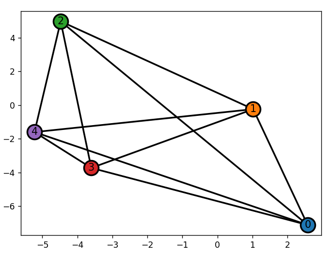

# Graph Multi Robot
基于**图论**对**多机器人系统**进行建模与控制

## 1、Usage

### 1.1、图系统的创建

导入多机器人控制包：

```python
from GMR import MultiRobot
```

可通过图论的方式定义一个多机器人系统，注意目前所支持的图是简单图，即没有环和平行边，但是每条边可设置权重(不设置的话默认权重为1)

```python
graph = {
    'node_size': 5,
    'edges': [[1,2], [1,3], [1,4], [1,5], [2,3], [2,4], [2,5], [3,4], [3,5], [4,5]]
}

MRobot = MultiRobot(graph, graph_type='undirected', indexBase='1-index'):
```
- `graph_type`：图的类型，可选参数为`undirected`和`directed`，分别对应无向图和有向图
- `indexBase`：节点索引的基数，可选参数为`0-index`和`1-index`

之后可以通过子模块 `Graph` 获取图的基本信息
```python
# 邻接矩阵
print('Adjacency Matrix: ', MRobot.Graph.adjmatrix)
# 关联矩阵
print('Incidence Matrix: ', MRobot.Graph.incmatrix)
# 度矩阵
print('Degree Matrix: ', MRobot.Graph.degreematrix)
# 拉普拉斯矩阵
print('Laplacian Matrix: ', MRobot.Graph.lapmatrix)
```

可视化展示图的结构
```python
MRobot.Graph.show()
```

<center></center>

### 1.2、典型图论算法


### 1.3、典型控制算法

## 2、TODO list
- [ ] 根据图创建多机器人系统
  - [ ] 无向图
  - [ ] 有向图
- [ ] 典型图论算法
- [ ] 典型控制器植入
